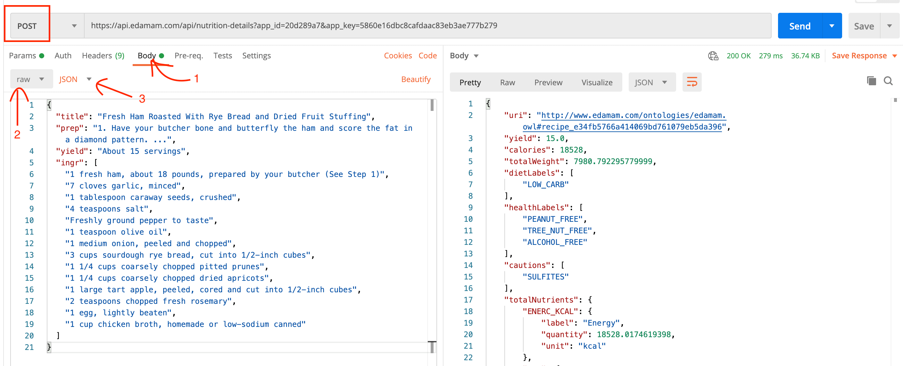

# Final Project

**Due Date: September 29, 2021 11:59pm**

For your final project, you will be leverage an API (or APIs) to display dynamic content onto a webpage. You will choose between one of these ideas below, or come up with your own idea that uses a public API.

1. A Movie Website
2. A Nutrition Website

## Project Goals

- To put together and make practical use of what was taught in class.
- To learn about developer practices, like setting up a new website, maintaining your own git repository and writing a _README.md_.
- To build a portfolio piece to show off to potential employers.

This project will put together these topics that were covered in class:

- Fundamentals of JavaScript
- AJAX and HTTP(s) requests
- Working with the DOM and events
- Structuring your project

## Project Requirements

You must meet these requirements in order to pass.

- Your project must make at least one asynchronous API call.
- You must use an asynchronous library or API that we covered in class (Fetch, Axios and/or Async & Await).
- You should display the data returned from an API on the user's screen in some fashion. For example, your API could return the name and image URLs of social media followers of a given person. You could then display the name and avatar of each follower on the page.
- Your code should not have any Cross Site Scripting (XSS) vulnerabilities. If you convert a string into HTML at any point, you must use a [library](https://www.npmjs.com/search?q=xss) to sanitize the HTML.
- You must handle two or more events.
- You must handle user input somewhere within the project. For example, handle a search engine or display text that the user typed somewhere on the screen.
- Your code should not contain `var`.
- You put your code in file(s) external to the HTML that are loaded with `<script>` tags. All JavaScript code should be enclosed within an Immediately Invoked Functional Expression (IIFE). You can attach any code that needs to be shared between files to the window. For example:

  ```html
  <!DOCTYPE html>
  <html lang="en">
    <head>
      <!-- ... -->
      <script src="https://code.jquery.com/jquery-3.5.1.min.js" defer></script>
      <script
        src="https://cdn.jsdelivr.net/npm/lodash@4.17.20/lodash.min.js"
        defer
      ></script>
      <script src="js/utils.js" defer></script>
      <script src="js/log.js" defer></script>
      <script src="js/dom.js" defer></script>
      <script src="js/app.js" defer></script>
    </head>
    <body>
      <!-- ... -->
    </body>
  </html>
  ```

  ```javascript
  // Wrap in Immediately Invoked Functional Express (IIFE) to protect your code
  (function () {
    const toTitleCase = (str) => {
      return str.replace(/\w\S*/g, function (txt) {
        return txt.charAt(0).toUpperCase() + txt.substr(1).toLowerCase();
      });
    };

    // Attach what you need to share between files to the window
    window.toTitleCase = toTitleCase;
  })();
  ```

- Your website should not crash at any point.

## Using APIs

### Registering and API Keys

For your project, you will need to use at least one API. Most APIs require that you register with them. You will have to signup and create an account. In return, you will typically get an API key, which you will need to include within your API AJAX request. How to do this can vary from API to API. You must read the API documentation to learn how to make requests, as this is a part of being a web developer.

For security reasons, you would normally store your API key in a separate file and and add the file to your _.gitignore_ so that it is not committed to git. However, since this is a portfolio piece, you might want to include your API in git repository anyways. Please note that if you do this, you are likely to get a security alert from Github. Employers may clone and repository and test out your project. Leave instructions in the _README.md_ on how to register for your API and include the API key in the project.

### Rate Limits

Please note that APIs often have rate limits. This means that they will block you after you make several requests within a day (usually around 1000 on the free tier). If the user will be making a search request, it is a good idea to [debounce](https://www.npmjs.com/package/debounce) the request, so that you or your users do not reach the quota.

### CORS

Another thing to note is that you can run into Cross-Origin Resource Sharing (CORS) issues with some APIs. (Sometimes this happens because you are developing things locally and you are using HTTP instead of HTTPS). You know will know that you are experiencing a CORS issue when you see an errors like this in your browser's console:

```
Access to XMLHttpRequest at 'https://api.yelp.com/v3/businesses/search?term=delis&latitude=37.786882&longitude=-122.399972' from origin 'null' has been blocked by CORS policy: Response to preflight request doesn't pass access control check: No 'Access-Control-Allow-Origin' header is present on the requested resource.
spread.js:25 Uncaught (in promise) Error: Network Error
    at e.exports (spread.js:25)
    at XMLHttpRequest.d.onerror (spread.js:25)
```

Test your API out in the Chrome, Firefox, Safari, Edge or another web browser before committing to an API. An API request may work fine with Postman, but not in a web browser.

[You can read more about CORS here](https://www.codecademy.com/articles/what-is-cors).

## Project Ideas

You can pick one of the following ideas, or come up with one on your own. These are open-ended ideas. We are giving you a lot of room to be creative, as long as your project meets the project requirements and is presentable to employers.

### 1. Create a Movie Website with the Movie DB API

Develop a movie website like iMDB or [The Movie DB](https://www.themoviedb.org/). Some of the things you can do is have a movie search page, display what movies are now playing, display the top rated movies, or display details about a single movie.

The Movie DB [provides three different movie APIs](https://www.themoviedb.org/documentation/api). You can [read the documentation on how to get started here](https://developers.themoviedb.org/3/getting-started/introduction). In order to use these APIs, you must [signup](https://www.themoviedb.org/documentation/api). You will then receive an API key. You will need to include the API key in the end of the URL of every AJAX request as a GET parameter. For example, to search for movies called _Frozen_, you would use this URL, replacing `<API_KEY>` with your API key.

```
https://api.themoviedb.org/3/search/movie?api_key=<API_KEY>&language=en-US&query=Frozen&page=1&include_adult=false
```

Note that you will need to substitute spaces with _%20_. So if you were searching for the movie _Frozen 2_, you would plugin _Frozen%202_ like this:

```
https://api.themoviedb.org/3/search/movie?api_key=<API_KEY>&language=en-US&query=Frozen%202&page=1&include_adult=false
```

The Movie DB also provides a sandbox where you can experiment with making different API requests. Click on the [Try it out](https://developers.themoviedb.org/3/search/search-movies) button, enter your API key where it says "Your TMDb API key", and then click on the _Send Request_ button near the bottom of the page.

You can use the ID of a movie returned in the results of the [Search](https://developers.themoviedb.org/3/search/search-movies) or [Discover](https://developers.themoviedb.org/3/discover/movie-discover) API to then look up a specific movie with the [Find API](https://developers.themoviedb.org/3/find/find-by-id).

Please note that the movie APIs do not send back the full image URL in the results. You will need to start the URL with `https://image.tmdb.org/t/p/w500/`. For example, if you get this response ...

```json
"results": [
  {
      "poster_path": "/qdfARIhgpgZOBh3vfNhWS4hmSo3.jpg",
      "original_title": "Frozen II",
      "title": "Frozen II",
      // ...
  },
  // ...
```

... the image URL should actually be `https://image.tmdb.org/t/p/w500/qdfARIhgpgZOBh3vfNhWS4hmSo3.jpg`. For more information, see the [documentation on images](https://developers.themoviedb.org/3/getting-started/images).

The Movie DB APIs have an option to filter out adult content. Your project will be presented to employers, so please read the documentation and use the adult filters.

### 2. Create a Nutrition Website with the Edamam API

Create a nutrition website. For example, users could search for different foods or you could have a predetermined list of meals. Your site can display the nutritional information of whatever the user clicks on.

Edamam provides three different APIs: a [Nutrition Analysis API](https://developer.edamam.com/edamam-docs-nutrition-api), a [Recipe Search API](https://developer.edamam.com/edamam-docs-recipe-api) and a [Food Database API](https://developer.edamam.com/food-database-api-docs). You will have to [signup for an api](https://developer.edamam.com/). Choose the "Developer" plan, which is free. Each API will have its own APP ID and API key. To retrieve or generate an API key:

1. [Login to the Edamam website](https://developer.edamam.com/login). (You may not receive a confirmation email. You can login right after signing up.)
2. Click on the "Dashboard" button in the upper right.
3. Click on the "Applications" tab in the main menu.

From here, you can click on the "View" button to retrieve your APP ID and API key. You can also click on the "Create a new application" if you would like to use a different API.

You will need to include the APP ID and API Key, as well as any GET parameters, in the URL itself. For example, say you are searching for chicken with the Recipe Search API. You would make a request to this URL, plugging in `<APP_ID>` and `<API_KEY>` with your credentials.

```
https://api.edamam.com/search?q=chicken&app_id=<APP_ID>&app_key=<API_KEY>
```

Note that you will need to substitute spaces with _%20_. For example, if you are looking up the nutritional value of a red apple using the Nutrition API, you would plugin _red%20apple_ into the URL like this:

```
https://api.edamam.com/api/food-database/v2/parser?ingr=red%20apple&app_id=<APP_ID>&app_key=<API_KEY>
```

The Nutrition Analysis API is different from the other Edamam APIs because it is a POST request. You must include the header `"Content-Type": "application/json"` and you must send it JSON. To test this API in postman, you must send JSON like this:



### 3. Your Own Idea

You are free to pursue another project idea, as long as it:

- Meets the project requirements
- You use at least one API. (You can browse [RapidAPI](https://rapidapi.com/hub) to discover other APIs.)
- You are able to realistically complete the project or at least have something presentable to employers by the deadline.

Please let Jamal and Matina known by **September 15th**. You must message them over Slack and provide them with your API's documentation. If they do not approve of your project, you will have to work with one of the suggested ideas above.

## Github Repository

You will need to [create a new public Github repository](https://help.github.com/en/articles/create-a-repo) for this project. It must be public. You should also include a _README.md_ and _.gitignore_ file.

Your _README.md_ file should be written in [Markdown](https://github.com/adam-p/markdown-here/wiki/Markdown-Cheatsheet). This should be written for employers who may be looking at your work. Describe your project and explain how to get started. You can find an example template of a _README.MD_ here:
https://github.com/othneildrew/Best-README-Template

You can generate _.gitignore_ file with [gitignore.io](https://www.toptal.com/developers/gitignore). If you have a _node_modules_ folder, be sure to include it in your _.gitignore_.

## Project Design

We realize that we did not teach design in this class, but there is no way to get around the fact that design must be a part of the process. We will not grade your project on how good it looks, but a good design will make a better impression with employers, so please try to make your application look as nice as possible.

## Code Quality

While you will not fail if you do not meet these quality requirements, we will ask you to resubmit your work if it is not up to a professional standard. One of the goals of this project is to help you build a portfolio. Just like an interviewer will judge you on your attire, employers will judge you on the neatness of your code.

- You should have _README.md_ written in Markdown. It should explain the purpose of the project, describe how to play the game, give instructions on how to install and start your project and credit yourself as the author. Here are some resources on creating _README.md_ files:
  - [Make a README](https://www.makeareadme.com/)
  - [Markdown cheatsheet](https://github.com/adam-p/markdown-here/wiki/Markdown-Cheatsheet)
- Add anything that should not be committed to your _.gitigore_ file. If applicable, the _node_modules_ folder should be ignored.
- Choose descriptive and specific names for variables, constants, functions and anything else that is named.
- You must not leave any debugging statements in your code. This means when you commit your code, remove any `console.log` statements.
- Only have actual comments within comment tags. Do not commit code that you commented out for debugging purposes.
- No errors should appear in the console.
- Remove any code that is not being used. (This affects application load time as well as code quality.)
- Use proper indentation. (Prettier can take care of this.)

## Project Submission

Submit your project by sending a link to your Github repository to your instructors over Slack by the deadline. Your project does not have to be 100% complete, but it does have to be presentable to employers.

AlbanyCanCode will host your project in a public space and they will be sharing your work with employers.

## Graduation and Project Showcase

There will be a virtual graduation and networking ceremony in October. You will receive an email from AlbanyCanCode with more information about this as we get closer to the date.

## Project Help

If you need help, please schedule a 1-on-1 with your instructors or any of the AlbanyCanCode staff who is available to help.
